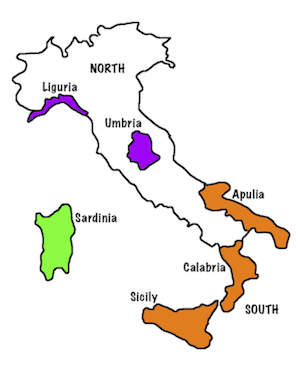

## What is classification?

- Supervised classification includes multivariate techniques finding a rule for separating observations/cases into known classes, and using this rule to classify new observations.
- The process starts with a training sample, that is the full data set with known classes. Typically the variables that will be used to generate the classification rule are easy/cheap to measure, but the class is more difficult to measure. It is important to be able to classify new observations using variables that are easy to measure.

## Supervised vs Unsupervised

Unsupervised classification, also called cluster analysis, differs from supervised in that the classes are not known ahead of time, and need to be discovered first and labelled. 

```{r fleaplots, cache=FALSE, echo=FALSE, warning=FALSE, message=FALSE, fig.show='hold', fig.height=4, fig.width=4}
library(ggplot2)
library(tourr)
library(dplyr)

data(flea)
qplot(tars1, aede1, data=flea, color=species) + 
  theme(aspect.ratio=1, legend.position="none")
qplot(tars1, aede1, data=flea) + theme(aspect.ratio=1)
```

## YOUR TURN

<div class="columns-2">

- Example data: Fatty acid composition of Italian olive oils. 

- Three growing regions: labelled 1, 2, 3

- Eight fatty acids, % in the sample x 100. 

- Two variables plotted (shown on next slide). How would you divide the data, so that if you received a new assayed sample you would be able to confidently predict which region produced the oil? 



</div>

## Olive oils

```{r olives, cache=FALSE, echo=FALSE, warning=FALSE, error=FALSE, message=FALSE, fig.height=5, fig.width=5}
data(olive)
olive$region <- factor(olive$region, labels=c("South", "Sardinia", "North"))
ol.m <- summarise(group_by(olive, region), eicosenoic=mean(eicosenoic),
                  linoleic=mean(linoleic))
qplot(eicosenoic, linoleic, data=olive, color=region, alpha=I(0.5)) +
  theme(legend.position="bottom", aspect.ratio=1)
```

## The simplest method 

- Calculate the mean of each class
- Calculate the distance between the new observation and each of the means
- Predict the new observation into the class of the closest mean

This is called *linear discriminant analysis* or *Fisher's linear discriminant*.

## Olive oils - LDA Rule 

```{r olives.lda, echo=FALSE, warning=FALSE, error=FALSE, message=FALSE, fig.height=5, fig.width=5}
olive.p <- data.frame(expand.grid(eicosenoic = seq(0, 60, 1), linoleic = seq(440, 1500, 10)))
library(MASS)
olive.lda <- lda(region~eicosenoic+linoleic, data=olive, 
                 prior=c(0.34, 0.33, 0.33))
olive.p$region <- predict(olive.lda, olive.p)$class
qplot(eicosenoic, linoleic, data=olive.p, color=region, alpha=I(0.2)) +
  geom_point(data=olive, aes(shape=region)) + 
  geom_point(data=ol.m, shape=3, size=5, color="black") +
  theme_bw() + theme(legend.position="bottom", aspect.ratio=1)
```

## YOUR TURN

- How close does the LDA boundaries match what you designed?
- What is different? 
- Why does it differ?

## LDA Rule for TWO groups, one variable

For a new observation, $x_0$, assign it to group 2 if 

$x_0 - \frac{\bar{x}_1 + \bar{x}_2}{2} \geq 0$

otherwise assign it to group 1. (Assuming that group 1 has the smaller mean.)

Another way to write the equation is:

$x_0 \geq \frac{\bar{x}_1 + \bar{x}_2}{2}$

## LDA Rule for TWO groups, one variable: olive oils

```{r lda-olive, cache=FALSE, echo=FALSE, warning=FALSE, error=FALSE, message=FALSE, fig.height=5, fig.width=5}
olive.sub <- subset(olive, region != "South")
olive.sub$region <- factor(olive.sub$region)
qplot(linoleic, data=olive.sub, fill=region, color=region, 
      geom="density", alpha=I(0.5)) +
  theme_bw() + theme(legend.position="bottom", aspect.ratio=1)
olive.lda <- lda(region~linoleic, data=olive.sub, 
                 prior=c(0.5, 0.5))
```

## LDA Rule for TWO groups, one variable: olive oils

```{r lda-olive2, cache=FALSE, echo=FALSE, warning=FALSE, error=FALSE}
olive.lda
```

$\frac{\bar{x}_1 + \bar{x}_2}{2}$ = `r sum(olive.lda$means)/2`

## LDA Rule for TWO groups, one variable: olive oils

<div class="columns-2">

```{r lda-olive3, cache=FALSE, echo=FALSE, warning=FALSE, error=FALSE, message=FALSE, fig.height=4, fig.width=4}
olive.sub <- subset(olive, region != "South")
olive.sub$region <- factor(olive.sub$region)
qplot(linoleic, data=olive.sub, fill=region, color=region, 
      geom="density", alpha=I(0.5)) +
  geom_vline(xintercept=961.78) +
  theme_bw() + theme(legend.position="bottom", aspect.ratio=1)
```

A sample with 10.5% linoleic acid content would be classified to which region?

What about a sample with 7.5% linoleic acid content?

</div>

## Theory

<div class="columns-2">

In a perfect world, if we assume we have two samples from two normal distributions with different means but same variance, then the LDA rule is exactly perfect. 

```{r lda-normal, cache=FALSE, echo=FALSE, warning=FALSE, error=FALSE, message=FALSE, fig.height=4, fig.width=4}
library(mvtnorm)
df <- data.frame(x=c(seq(-5, 5, 0.1), seq(-5, 5, 0.1)), 
  y=c(dnorm(seq(-5, 5, 0.1), mean=-2), dnorm(seq(-5, 5, 0.1), mean=2)), 
      cl=c(rep("A", 101), rep("B",101)))
qplot(x, y, data=df, geom="line", colour=cl) +
  geom_vline(xintercept=0) +
  theme_bw() + theme(legend.position="bottom")
```
</div>

## More than one variable

## Accuracy and Error

## Notes to self

- Give terminology
- Add creative commons license