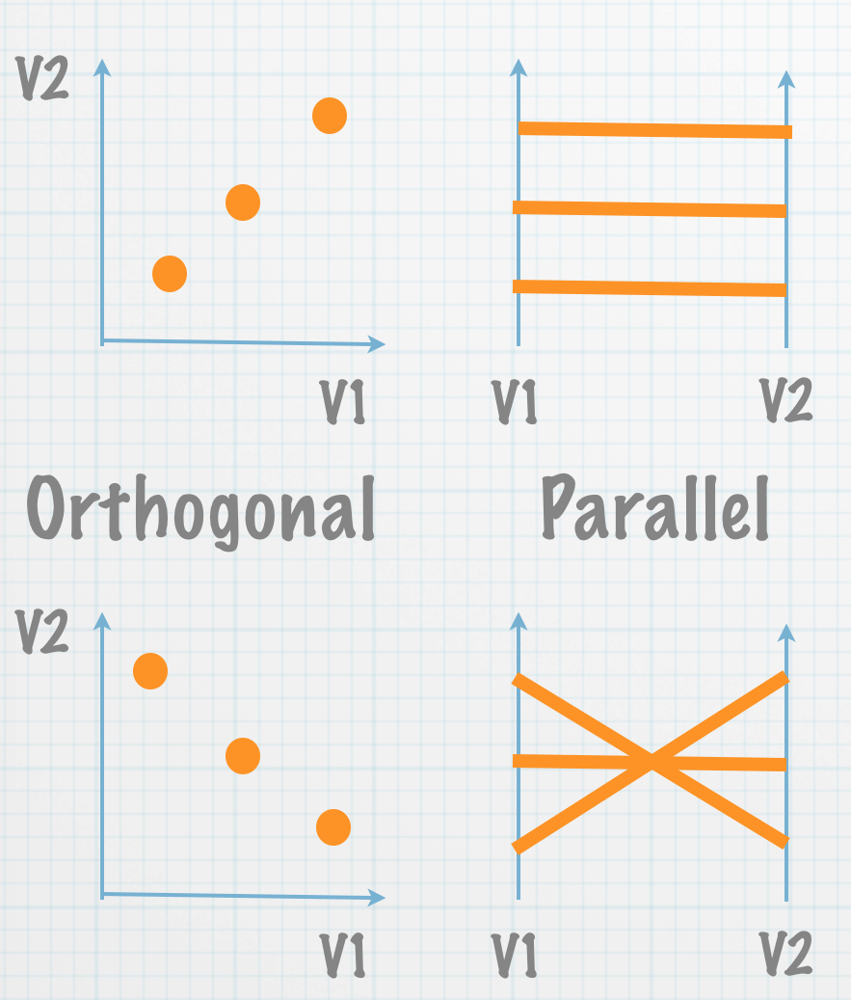
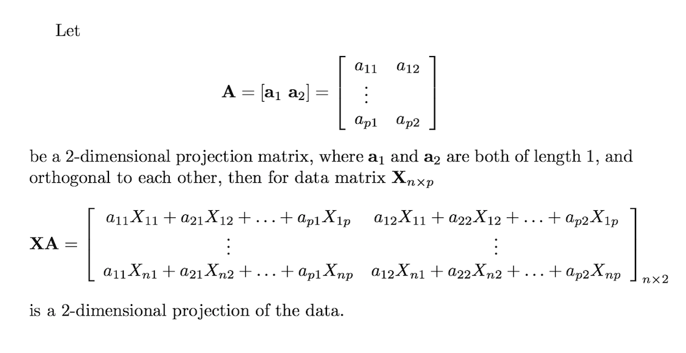

## Multivariate data?

- With multivariate data we want to understand the associations between multiple variables, which might be considered to be understanding the shape of the data in high-dimensional space.
- Graphics are used to explore the data, and also to diagnose models. 
- Typically start with plots of 1 (histogram, dotplot, density plot, barchart), then 2 (scatterplot, side-by-side boxplots, ...), then more variables.

## Plotting in more than 2-dimensions

- Scatterplot matrix
- Parallel coordinate plot
- Tours

## Scatterplot matrix

- Show all pairs of variables
- If numeric, use a scatterplot - this is the traditional
- If variables types different, use an appropriate plot accordingly 

## Example: chocolates nutrition info

- Nutritional information for the equivalent of 100g bars: Calories, CalFat, TotFat, SatFat, Chol, Na, Carbs, Fiber, Sugars, Protein
- 88 chocolates from 30 different manufacturers, 8 different countries
- Both dark and milk chocolates

```{r read-choc, cache=FALSE, echo=FALSE, warning=FALSE, message=FALSE, fig.width=5, fig.height=5}
library(sillylogic)
choc <- read.csv("../data/chocolates.csv", stringsAsFactors = HELLNO)
dim(choc)
table(choc$Type)
```

## Scatterplot matrix

```{r scatmat-choc, cache=FALSE, echo=FALSE, warning=FALSE, message=FALSE, fig.width=5, fig.height=5}
library(GGally)
library(ggplot2)
ggscatmat(choc,columns=c(5,7,11,12,13,14))
```

## Colored by type

```{r scatmat-choc2, cache=FALSE, echo=FALSE, warning=FALSE, message=FALSE, fig.width=7, fig.height=5.5}
choc$Type <- factor(choc$Type)
ggscatmat(choc,columns=c(5,7,11,12,13,14), color="Type") + theme_bw()
```

## Difference

- How do milk and dark chocolates differ?
- What are some other features in the data that are visible?

## Catgorical variables

```{r scatmat-tips, cache=FALSE, echo=FALSE, warning=FALSE, message=FALSE, fig.width=6.0, fig.height=5.5}
library(reshape2)
data(tips)
ggpairs(tips, columns=c(1,2,3,4,7))
```

## What do you see?

- postive association between tip and total bill
- bill slightly higher when male is paying, on average
- ...
- ...

## Parallel coordinate plot



## Example: chocolates

```{r parcoords-choc, cache=FALSE, echo=FALSE, warning=FALSE, message=FALSE, fig.width=7.0, fig.height=4.5}
ggparcoord(choc, columns=5:14, groupColumn="Type")
```

## Scaling changes appearance

```{r parcoords-choc2, cache=FALSE, echo=FALSE, warning=FALSE, message=FALSE, fig.width=7.0, fig.height=4.5}
ggparcoord(choc, columns=5:14, groupColumn="Type", scale="uniminmax")
```

## Re-ordering variables can help more

```{r parcoords-choc3, cache=FALSE, echo=FALSE, warning=FALSE, message=FALSE, fig.width=7.0, fig.height=4.5}
ggparcoord(choc, columns=5:14, groupColumn="Type", scale="uniminmax", order="allClass")
```

## Re-ordering variables can help more

```{r parcoords-choc4, cache=FALSE, echo=FALSE, warning=FALSE, message=FALSE, fig.width=7.0, fig.height=4.5}
ggparcoord(choc, columns=c(6,7,12,11,13), groupColumn="Type")
```

## What do we learn?

- difference between milk and dark
- unusual chocolates
- 

## Categorical variables

```{r parcoords-leastangle, cache=FALSE, echo=FALSE, warning=FALSE, message=FALSE, fig.width=7.0, fig.height=4.5}
library(ggparallel)
titanic <- as.data.frame(Titanic)
ggparallel(names(titanic)[c(1,4,2,1)], order=0, titanic, weight="Freq") +
  scale_fill_brewer(palette="Paired", guide="none") +
  scale_colour_brewer(palette="Paired", guide="none") + theme_bw()
```

## Tours

- Let's take a look at the chocolates with a tour, before I explain what the method does.

```
library(rggobi)
ggobi(choc)
# Run outside of R
ggobi chocolates.csv
```

## Tour explanation

- A movie of low-dimensional projections of high-dimensional space.



- Changing projection matrix values produces the movie.

## Tour

- Show videos

- Similarity to biplot

## Linking on NRC data


## Time series: Exchange rates

## Tennis data

## Maps

Australia election data

