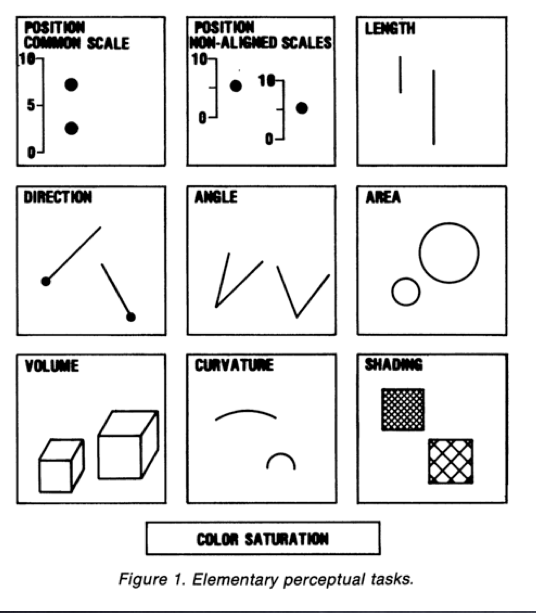
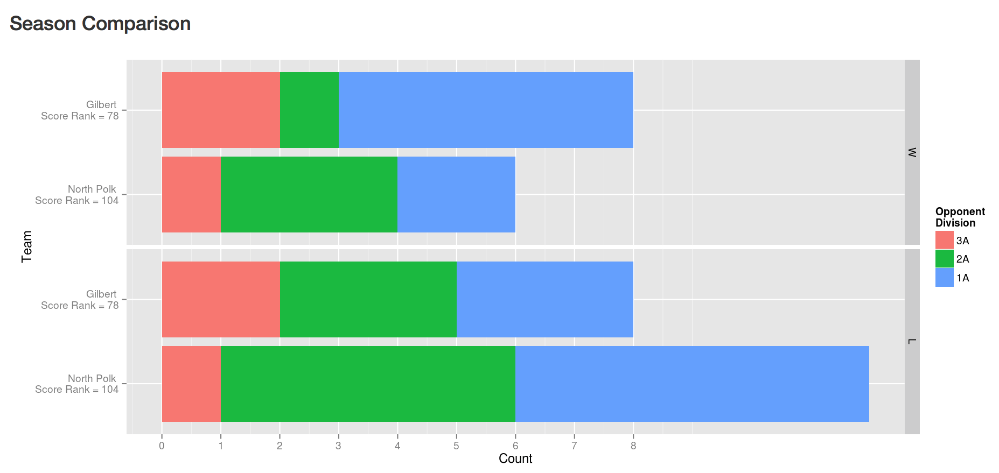

## What makes a data plot?

- data
- aesthetics: mapping of variables to graphical elements
- geom: type of plot structure to use
- layers

## Example: Oscars

Extracted from The Oscars Database. https://oscars.silk.co. Best actors, actresses and directors, only.

Motivation "Tonight we honor Hollywood’s best and whitest– sorry, brightest" (Neil Patrick Harris, Oscars 2015)

```{r oscars, cache=FALSE, echo=FALSE, warning=FALSE, message=FALSE}
oscars <- read.csv("../data/oscars.csv", stringsAsFactors=FALSE)
acting <- subset(oscars, AwardCategory=="Actor")
#library(xtable)
#print(xtable(acting$Ethnicity), type="latex")
data.frame(table(acting$Ethnicity))
```

## Variables

- Categorical: Name, Sex, Birthplace, CityofBirth, State, Ethnicity, SexualOrientation, Religion, AwardCategory, Movie, Country

- Quantitative: Age, NumberofAwards

- Temporal: DOB, Year

## Mapping hierarchy

Cleveland & McGill (1984) 

Data element to graphical element in rank order of accuracy in returning data value, is as follows:

1. Position - common scale
2. Position - nonaligned scale
3. Length, direction, angle
4. Area
5. Volume, curvature
6. Shading, color

Results corroborated by Heer & Bostock (2010).

## Mapping hierarchy



## Basic mappings

Quantitative information should be mapped to position along a line, as first preference. Only two quantitative variables in the data: Age, NumberofAwards. Could treat year as quantitive to begin, too.

Unit of the data is person, award winner, aggregate this for categorical variables. 
Then we will have counts for categories, which is quantitative elements that should be mapped to position along a line.

## Let's look at Ethnicity. 

- In R, the best plotting package is ```ggplot2```, good defaults (mostly) and conceptual structure underlying drawing data.
- How are data elements mapped to graphical elements?
- Are the number of Asian Oscar recipients higher than Hispanic?

```{r ethnicity-pie, cache=FALSE, echo=FALSE, warning=FALSE, message=FALSE, fig.width=4.5, fig.height=4, fig.align="right"}
library(ggplot2)
library(grid)
qplot(factor(1), fill=Ethnicity, data=acting) + coord_polar(theta = "y") + 
  xlab("") + ylab("") + theme_bw() + 
  theme(axis.text=element_text(size=8), axis.title=element_text(size=10), 
        legend.key.size=unit(0.15, "in"))
```

## Bar chart

```
library(ggplot2)
qplot(Ethnicity, data=acting) + coord_flip()
```

- Are the number of Asian Oscar recipients higher than Hispanic?

```{r ethnicity, cache=FALSE, echo=FALSE, warning=FALSE, message=FALSE, fig.width=3, fig.height=2}
library(ggplot2)
qplot(Ethnicity, data=acting) + coord_flip() + 
  theme(axis.text=element_text(size=8), axis.title=element_text(size=10))
```

## Drill down

- The bar for whites is SO big, remove to focus on other categories. 

```{r ethnicity-nonw, cache=FALSE, echo=FALSE, warning=FALSE, message=FALSE, fig.width=3, fig.height=2}
qplot(Ethnicity, data=subset(acting, Ethnicity != "White")) + coord_flip() + 
  theme(axis.text=element_text(size=8), axis.title=element_text(size=10))
```

## Grammar

```qplot(Ethnicity, data=acting)```

- Data and variable are supplied. Implicit to these instructions, is the mapping and geom.

```ggplot(data=acting) + geom_bar(mapping=aes(x=Ethnicity, y=..count..))```

- `x` is mapped to categorical variable
- `y` is automatically calculated as the count of each level
- `count` is represented as a bar (read off using position along a line)

## Order matters

- Sort categories by total count. 

```
acting$Ethnicity <- factor(acting$Ethnicity, 
      levels=c("White", "Black", 
               "Hispanic", "Asian", 
               "Multiracial", 
               "Middle Eastern"))
qplot(Ethnicity, data=subset(acting, 
                Ethnicity != "White"))
```
## Ordered bars

```{r order, cache=FALSE, echo=FALSE, warning=FALSE, message=FALSE, fig.width=3, fig.height=2}
qplot(Ethnicity, data=subset(acting, Ethnicity != "White")) + coord_flip() +
  theme(axis.text=element_text(size=8), axis.title=element_text(size=10))
```

## Adding color

- Color bars by gender

```
qplot(Ethnicity, data=subset(acting, Ethnicity != "White"), 
  fill=Sex) + coord_flip()
```
    
```{r color, cache=FALSE, echo=FALSE, warning=FALSE, message=FALSE, fig.width=4, fig.height=2, fig.align="right"}
qplot(Ethnicity, data=subset(acting, Ethnicity != "White"), fill=Sex) +
    coord_flip() + 
  theme(axis.text=element_text(size=8), axis.title=element_text(size=10))
```

## Color choice

- There are several choices of color schemes: RColorBrewer developed for maps, and is good for area plots.  

```
qplot(Ethnicity, data=subset(acting, Ethnicity != "White"), 
  fill=Sex) + scale_fill_brewer(type="qual", palette=2) +
  coord_flip()
```

```{r colorchoose, cache=FALSE, echo=FALSE, warning=FALSE, message=FALSE, fig.width=4, fig.height=2, fig.align="right"}
library(RColorBrewer)
# display.brewer.all() # To see possible palettes
qplot(Ethnicity, data=subset(acting, Ethnicity != "White"), fill=Sex) + 
  scale_fill_brewer(type="qual", palette=2) +
  coord_flip() + 
  theme(axis.text=element_text(size=8), axis.title=element_text(size=10))
```

## Mosaic

- To read proportions, along with counts of major variable, it is better to replace stacking with a mosaic plot (using ```plotluck``` package. 
- Notice that bars are now sorted by proportion.

```{r mosaic, cache=FALSE, echo=FALSE, warning=FALSE, message=FALSE, fig.width=4.5, fig.height=4.5, fig.align="right"}
library(plotluck)
plotluck(acting, Ethnicity, Sex)
```

## Temporal Trend

- These numbers are aggregated across almost 100 years of Oscar winners. 
- Maybe the proportions have changed over time.
- We will aggregate by decade, and compute proportions for each ethnic class, and take a look at these.

```{r years, cache=FALSE, echo=FALSE, warning=FALSE, message=FALSE}
summary(acting$Year)
```

## Temporal Trend

```{r time, cache=FALSE, echo=FALSE, warning=FALSE, message=FALSE, fig.width=6, fig.height=4}
acting$Decade <- floor(acting$Year/10)*10
ptable <- data.frame(prop.table(table(acting$Decade, acting$Ethnicity), 1))
colnames(ptable) <- c("Decade", "Ethnicity", "Prop")
ptable$Decade <- as.numeric(as.character(ptable$Decade))
```

```{r time2, cache=FALSE, echo=FALSE, warning=FALSE, message=FALSE, fig.width=6, fig.height=4}
qplot(Decade, Prop, data=ptable, colour=Ethnicity, group=Ethnicity, size=I(5)) + geom_line()
```

## Facetting

- Whites dominate again, so lets use facetting to zoom in. Focus only on ethnicities with reasonable numbers. 

```{r facets, cache=FALSE, echo=FALSE, warning=FALSE, message=FALSE, fig.width=7, fig.height=4}
qplot(Decade, Prop, data=subset(ptable, Ethnicity=="White"|Ethnicity=="Black"), colour=Ethnicity, group=Ethnicity, size=I(5)) + geom_line() + scale_colour_brewer(type="qual", palette=2) +
facet_wrap(~Ethnicity, scales="free_y")
```

## Examine trend

- Use a trend line, loess, instead of connecting the dots.

```{r trend, cache=FALSE, echo=FALSE, warning=FALSE, message=FALSE, fig.width=7, fig.height=4}
qplot(Decade, Prop, data=subset(ptable, Ethnicity=="White"|Ethnicity=="Black"), 
      colour=Ethnicity, size=I(5)) + geom_smooth(se=F) + 
  scale_colour_brewer(type="qual", palette=2) +
  facet_wrap(~Ethnicity, scales="free_y")
```

## Layering

- Pull demographics data from http://en.wikipedia.org/wiki/Historical_racial_and_ethnic_demographics_of_the_United_States. 

- Overlay these values as a line plot on the Oscars proportions.

```{r layers, cache=FALSE, echo=FALSE, warning=FALSE, message=FALSE, fig.width=7, fig.height=4}
library(reshape2)
pop.prop <- read.csv("../data/wiki-race.csv")
pop.prop.m <- melt(pop.prop[,1:3], id="Year")
colnames(pop.prop.m) <- c("Decade", "Ethnicity", "Prop")
pop.prop.m$Prop <- pop.prop.m$Prop/100
```

## Layering

```{r layers2, cache=FALSE, echo=FALSE, warning=FALSE, message=FALSE, fig.width=7, fig.height=3.5}
qplot(Decade, Prop, data=subset(ptable, Ethnicity=="White"|Ethnicity=="Black"), 
      colour=Ethnicity, group=Ethnicity, size=I(5)) +
  facet_wrap(~Ethnicity, scales="free_y") +
  geom_line(data=pop.prop.m, aes(x=Decade, y=Prop, colour=Ethnicity, group=Ethnicity)) + 
  scale_colour_brewer(type="qual", palette=2) 
```

## Perceptual principles: proximity

- Place elements for primary comparison close together. 
- Is a week day/weekend day pattern? 
- Better to plot proportions.


```{r proximity1, cache=FALSE, echo=FALSE, warning=FALSE, message=FALSE, fig.width=7, fig.height=3.5}
library(dplyr)
hotel <- read.csv("../data/hotel-cleaned.csv", stringsAsFactors=FALSE)
hotel$s.weekd <- factor(hotel$s.weekd, 
  levels=c("Monday", "Tuesday", "Wednesday", "Thursday", "Friday", "Saturday", "Sunday"), 
  labels=c("M","Tu","W", "Th", "F", "Sa","Su"))
d <- summarise(group_by(hotel, s.weekd), p=length(purchase[purchase==1])/length(purchase))
qplot(s.weekd, p, data=d, geom=c("point", "line"), ylim=c(0,0.045), 
      xlab="Day of the Week", ylab="Proportion purchased", group=1)
```

## Perceptual principles: proximity

Rearrange into proportions, and plot these as points. The question "Is there a difference in purchase rate by day of search?" Proportions better answers this question. (Numbers for each day of the week are large enough for proportion to be reliably interpreted.)


```{r proximity2, cache=FALSE, echo=FALSE, warning=FALSE, message=FALSE, fig.width=7, fig.height=3.5}
library(dplyr)
hotel <- read.csv("../data/hotel-cleaned.csv", stringsAsFactors=FALSE)
hotel$s.weekd <- factor(hotel$s.weekd, 
  levels=c("Monday", "Tuesday", "Wednesday", "Thursday", "Friday", "Saturday", "Sunday"), 
  labels=c("M","Tu","W", "Th", "F", "Sa","Su"))
d <- summarise(group_by(hotel, s.weekd), p=length(purchase[purchase==1])/length(purchase))
qplot(s.weekd, p, data=d, geom=c("point", "line"), ylim=c(0,0.045), 
      xlab="Day of the Week", ylab="Proportion purchased", group=1)
```

## Perceptual principles: proximity

Primary purpose is to examine wins and losses of two teams. Closest bars are the two teams, faceted by win/loss. 



## Perceptual principles: color

Applying color takes some care: 

1. Color is a pre-attentive graphical element, which means people see it before they realize they see it. If most elements are blue and one is red we will pick the red element out SO QUICKLY.
2. Color is low on the scale of accurate reading. Use sparingly. 
3. Map the appropriate information to the appropriate scale:

- Use QUALITATIVE scales to display categorical data, small number of levels, 
- SEQUENTIAL scales are used to represent a gradient of quantitative information, e.g. 0-100
- DIVERGING scales are used to represent negative to positive quantitative information.

## Color blindness

Color choice can affect whether all your audience can see what you see.

```{r color2, cache=FALSE, echo=FALSE, warning=FALSE, message=FALSE, fig.width=7, fig.height=3.5}
library(dichromat)
library(scales)
clrs <- hue_pal()(2)
qplot(Ethnicity, data=subset(acting, Ethnicity != "White"), fill=Sex) + 
  scale_fill_manual(values=clrs) +
  coord_flip() + theme(legend.position="bottom")
```

## Color blind-proofing

Using the package ```dichromat```, to see what this looks like to a red-green color blind eye.

```{r color3, cache=FALSE, echo=FALSE, warning=FALSE, message=FALSE, fig.width=7, fig.height=3.5}
clrs <- dichromat(hue_pal()(2))
qplot(Ethnicity, data=subset(acting, Ethnicity != "White"), fill=Sex) + 
  scale_fill_manual(values=clrs) +
  coord_flip() + theme(legend.position="bottom")
```

## Exploring the Oscars 

- How does the age of the winners change, on average by gender, over time?

```{r explore, cache=FALSE, echo=FALSE, warning=FALSE, message=FALSE, fig.width=7, fig.height=3.5}
qplot(factor(Decade), Age, data=acting, geom="boxplot")
```

## Exploring the Oscars 

```{r explore2, cache=FALSE, echo=FALSE, warning=FALSE, message=FALSE, fig.width=7, fig.height=3.5}
qplot(Decade, Age, data=acting, geom=c("point", "smooth"), se=F)
```

## Exploring the Oscars 

- Is there a difference between best actor vs best actress?

```{r explore3, cache=FALSE, echo=FALSE, warning=FALSE, message=FALSE, fig.width=7, fig.height=3.5}
qplot(factor(Decade), Age, data=acting, geom="boxplot", facets=.~Sex) + xlab("Decade")
```

## Exploring the Oscars 

- Difference between best actor vs best actress ages, by decade?

```{r explore4, cache=FALSE, echo=FALSE, warning=FALSE, message=FALSE, fig.width=7, fig.height=3.5}
qplot(factor(Decade), Age, data=acting, geom="boxplot", fill=Sex) + 
  xlab("Decade") +
  theme(legend.position="bottom")
```

## Showing the statistics

- Compute the mean for each decade and show this

```{r stats, cache=FALSE, echo=FALSE, warning=FALSE, message=FALSE, fig.width=7, fig.height=3.5}
agesex <- summarise(group_by(acting, Decade, Sex), m=mean(Age, na.rm=T), 
                    s=qt(0.975, length(Age)-1)*sd(Age, na.rm=T)/length(Age))
qplot(Decade, m, data=agesex, group=Sex, colour=Sex, geom=c("point", "line")) + 
  ylab("Ave Age") +
  theme(legend.position="bottom")
```

## Showing the statistics

- Add a 95% point-wise confidence interval

```{r stats2, cache=FALSE, echo=FALSE, warning=FALSE, message=FALSE, fig.width=7, fig.height=3.5}
qplot(Decade, m, data=agesex, group=Sex, colour=Sex, geom=c("point", "line")) + 
  geom_ribbon(mapping=aes(ymin=m-s, ymax=m+s, fill=Sex), alpha=0.5) +
  ylab("Ave Age") +
  theme(legend.position="bottom")
```

## Resources

- 'R Graphics Cookbook' Winston Chang http://www.cookbook-r.com/Graphs/
- ggplot2 http://ggplot2.org/ (On the graphics package specifics)
- https://github.com/garrettgman (Basic R usage)
- http://yihui.name/knitr/ (Rmarkdown usage)
- http://stackoverflow.com (Q/A site with LOTS of useful info)
- `Creating More Effective Graphs' Naomi Robbins http://www.nbr-graphs.com (Conceptual)
