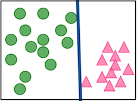
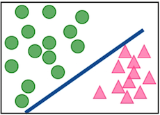
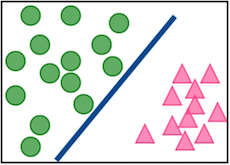
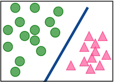
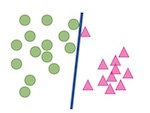
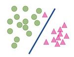

## LDA to SVM

- Support vector machines build a classifier by finding **gaps** between clusters
- Primarily only work on two classes at a time, so multiclass problems need some tweaking of approach
- Let's look at how it works on the same three examples as used for LDA

```{r libraries, echo=FALSE, warning=FALSE, error=FALSE, message=FALSE}
library(ggplot2)
library(tourr)
library(dplyr)
library(e1071)
library(MASS)
library(mvtnorm)
```

## Boundaries for Olive oils: LDA, SVM  

```{r olivessvm, echo=FALSE, warning=FALSE, error=FALSE, message=FALSE, fig.height=2.5, fig.width=2.5, fig.show='hold'}
data(olive)
olive.p <- data.frame(expand.grid(eicosenoic = seq(0, 60, 1), linoleic = seq(440, 1500, 10)))
olive$region <- factor(olive$region, levels=1:3, labels=c("south", "sardinia", "north"))
olive.lda <- lda(region~eicosenoic+linoleic, data=olive, 
                 prior=c(0.34, 0.33, 0.33))
olive.p$region <- predict(olive.lda, olive.p)$class
qplot(eicosenoic, linoleic, data=olive.p, color=region, alpha=I(0.1)) +
  geom_point(data=olive, aes(shape=region)) + 
  theme_bw() + theme(aspect.ratio=1, legend.position="none")
olive.svm <- svm(region~eicosenoic+linoleic, data=olive, kernel="linear")
olive.p$region <- predict(olive.svm, olive.p)
qplot(eicosenoic, linoleic, data=olive.p, color=region, alpha=I(0.1)) +
  geom_point(data=olive, aes(shape=region)) + 
  theme_bw() + theme(aspect.ratio=1, legend.position="none")
```

## Boundaries for Beetles: LDA, SVM 

```{r fleasvm, echo=FALSE, warning=FALSE, error=FALSE, message=FALSE, fig.height=2.5, fig.width=2.5, fig.show='hold'}
data(flea)
flea.p <- data.frame(expand.grid(tars1 = seq(120, 250, 1), aede1 = seq(110, 160, 1)))
flea.lda <- lda(species~tars1+aede1, data=flea, 
                 prior=c(0.34, 0.33, 0.33))
flea.p$species <- predict(flea.lda, flea.p)$class
qplot(tars1, aede1, data=flea.p, color=species, alpha=I(0.1)) +
  geom_point(data=flea, aes(shape=species)) + 
  theme_bw() + theme(aspect.ratio=1, legend.position="none")
flea.svm <- svm(species~tars1+aede1, data=flea, kernel="linear")
flea.p$species <- predict(flea.svm, flea.p)
qplot(tars1, aede1, data=flea.p, color=species, alpha=I(0.1)) +
  geom_point(data=flea, aes(shape=species)) + 
  theme_bw() + theme(aspect.ratio=1, legend.position="none")
```

## Boundaries for Crabs: LDA, SVM   

```{r crabsvm, echo=FALSE, warning=FALSE, error=FALSE, message=FALSE, fig.height=2.5, fig.width=2.5, fig.show='hold'}
crab <- read.csv("http://www.ggobi.org/book/data/australian-crabs.csv")
crab.p <- data.frame(expand.grid(FL = seq(7, 23.5, 0.2), RW = seq(6.3, 20.5, 0.2)))
crab.lda <- lda(sex~FL+RW, data=crab, 
                 prior=c(0.5, 0.5))
crab.p$sex <- predict(crab.lda, crab.p)$class
qplot(FL, RW, data=crab.p, color=sex, alpha=I(0.1)) +
  geom_point(data=crab, aes(shape=sex)) + 
  theme_bw() + theme(aspect.ratio=1, legend.position="none")
crab.svm <- svm(sex~FL+RW, data=crab, kernel="linear")
crab.p$sex <- predict(crab.svm, crab.p)
qplot(FL, RW, data=crab.p, color=sex, alpha=I(0.1)) +
  geom_point(data=crab, aes(shape=sex)) + 
  theme_bw() + theme(aspect.ratio=1, legend.position="none")
```

## Comparison

- Which boundaries look better?
- Why?

## How does SVM work?

- Variables $(x_1, ..., x_p)$ need to be standardized
- Class $(y)$ is coded as $\pm 1$
- Separating hyperplane defined to be  $\{x: x^Tb + b_o=0\}$ ($x,b$ are $p-$dimensional vectors)
- where $b=\sum_{i=1}^s (\alpha_iy_i)x_i$
- $s$ is the number of support vectors
- estimated by maximizing margin $M = 2/||b||$ subject to $\sum_1^p b_i^2 = 1$, $y_i(x_i^Tb+b_o)\geq 1, i=1,...,n$

## Best separating hyperplane

- All are separating hyperplanes. Which is best?







## Maximum margin


## Support vectors


## Support vectors for the olive oil classification

```{r olivessvs, echo=FALSE, warning=FALSE, error=FALSE, message=FALSE, fig.height=2.5, fig.width=2.5, fig.show='hold'}
indx <- olive.svm$index[abs(olive.svm$coefs[,1])<1 & abs(olive.svm$coefs[,2])<1]
svs <- olive[indx,]
qplot(eicosenoic, linoleic, data=olive.p, color=region, alpha=I(0.01)) +
  geom_point(data=olive, aes(shape=region)) + 
  geom_point(data=svs, color="black", shape=1, size=3) +
  theme_bw() + theme(aspect.ratio=1, legend.position="none")
svs <- olive[olive.svm$index,]
qplot(eicosenoic, linoleic, data=olive.p, color=region, alpha=I(0.01)) +
  geom_point(data=olive, aes(shape=region)) + 
  geom_point(data=svs, color="black", shape=1, size=3) +
  theme_bw() + theme(aspect.ratio=1, legend.position="none")
```

## Simulation example

```{r sim, echo=FALSE, warning=FALSE, error=FALSE, message=FALSE, fig.height=3.5, fig.width=3.5}
df <- data.frame(x1=scale(c(0.8, 1.2, 0.8, 
                      -1, -1.2, -0.8)), 
                x2=scale(c(0.8, 0.8, 1.2, 
                     -1, -1.2, -1.2)), 
                y=c(1,1,1,-1,-1,-1)) 
df
```

## Simulation example

```{r sim2, echo=FALSE, warning=FALSE, error=FALSE, message=FALSE, fig.height=3.5, fig.width=3.5}
qplot(x1, x2, data=df, shape=factor(y), color=factor(y), size=I(2)) + theme_bw() + theme(aspect.ratio=1, legend.position="none")
```

## Fit the classifier

```
df.svm <- svm(y~., data=df, kernel="linear")
df.svm$SV
df.svm$index
df.svm$coefs
```

```{r sim3, echo=FALSE, warning=FALSE, error=FALSE, message=FALSE, fig.height=3.5, fig.width=3.5}
df.svm <- svm(y~., data=df, kernel="linear")
df.svm$SV
df.svm$index
df.svm$coefs
```

## Calculate

$b=\sum_{i=1}^s (\alpha_iy_i)x_i$

```
t(as.matrix(df.svm$coefs))%*%df.svm$SV
``` 

```{r sim4, echo=FALSE, warning=FALSE, error=FALSE, message=FALSE}
t(as.matrix(df.svm$coefs))%*%df.svm$SV
```

$\{x: 0.486x_1 + 0.517x_2 + b_o=0\}$

`df.svm$rho`

```{r sim5, echo=FALSE, warning=FALSE, error=FALSE, message=FALSE}
df.svm$rho
```

## Look at it

```{r sim6, echo=FALSE, warning=FALSE, error=FALSE, message=FALSE, fig.height=3.5, fig.width=3.5}
b <- -0.4860445/0.5165415
a0 <- df.svm$rho 
svs <- data.frame(df.svm$SV)
qplot(x1, x2, data=df, shape=factor(y), color=factor(y), size=I(2)) + theme_bw() + theme(aspect.ratio=1, legend.position="none") + 
  geom_abline(intercept=a0, slope=b) +
  geom_point(data=svs, shape=1, color="black", size=3) 
```

## Non-separable, and outliers

- Outliers can overly influence a strict boundary




## Non-separable

- estimated by maximizing margin $M = 2/||b||$ 
- subject to $\sum_1^p b_i^2 = 1$, $y_i(x_i^Tb+b_o)\geq M(1-\epsilon_i), i=1,...,n$, where $b=\sum_{i=1}^s (\alpha_iy_i)x_i$
- $\epsilon_i\geq 0$, and $\sum_1^n \epsilon_i < C$ where $C$ is a non-negative tuning parameter

## Nonlinear separability

- Variables $(x_1, ..., x_p)$ could be expanded to include $(x_1^2, ..., x_p^2)$
- then proceed with building classifier in the expanded space
- maximize margin $M = 2/||b||$ subject to $\sum_1^p b_{1i}^2 + \sum_1^p b_{2i}^2 = 1$, $y_i((x_i^2)^Tb_2 + x_i^Tb_1+b_o)\geq M(1-\epsilon_i)$

## Kernels - make nonlinear classification easy to define

- Because $b=\sum_{i=1}^s (\alpha_iy_i)x_i$ 
- $y_i(x_i^Tb+b_o)$ can be written as
- $y_i(\alpha_i x_i^Tx_i+b_o)$ 
-
- $x_i^Tx_i$ can be wrapped into a kernel function $K(x_i^Tx_i)$ which enables building nonlinear boundaries

## Common kernels


## Examples

```{r sim7, echo=FALSE, warning=FALSE, error=FALSE, message=FALSE, fig.height=3.5, fig.width=3.5}
x <- rmvnorm(700, mean=rep(0, 2))
x.dist <- apply(x, 1, function(x) sqrt(x[1]^2+x[2]^2))
x <- x[order(x.dist),]
x.dist <- sort(x.dist)
y <- ifelse(x.dist<1, "A", "B")
x <- x[x.dist<0.7 | x.dist>1.8,]
y <- y[x.dist<0.7 | x.dist>1.8]
x <- scale(x)
df<-data.frame(x1=x[,1], x2=x[,2], y=y)
qplot(x1, x2, data=df, shape=y, color=y) + theme_bw() + theme(aspect.ratio=1)
```

## Examples

```{r sim8, echo=FALSE, warning=FALSE, error=FALSE, message=FALSE, fig.height=3.5, fig.width=3.5}
df.svm <- svm(y~., data=df)
df.svm
df.svm$SV 
df.svm$coefs
```

## Examples

```{r sim9, echo=FALSE, warning=FALSE, error=FALSE, message=FALSE, fig.height=3.5, fig.width=3.5}
pred.grid <- expand.grid(x1=seq(min(df$x1),max(df$x1),0.1), x2=seq(min(df$x2),max(df$x2), 0.1))
pred.grid$y <- predict(df.svm, pred.grid)
qplot(x1, x2, data=pred.grid, shape=y, color=y, alpha=I(0.1)) + theme_bw() +
  geom_point(data=df) + 
  theme(aspect.ratio=1, legend.position="none")
```

## Examples: olive oils

```{r olive-nl, echo=FALSE, warning=FALSE, error=FALSE, message=FALSE, fig.height=2.5, fig.width=2.5, fig.show='hold'}
qplot(eicosenoic, linoleic, data=olive, color=region, shape=region, alpha=I(0.5)) +
  scale_color_hue("") + scale_shape_discrete("") +
  theme_bw() + theme(aspect.ratio=1, legend.position="bottom")
olive.sub <- filter(olive, region != "south")
olive.sub$region <- factor(olive.sub$region)
qplot(linoleic, arachidic, data=olive.sub, colour=region, shape=region) +
  scale_color_hue("") + scale_shape_discrete("") +
  theme_bw() + theme(aspect.ratio=1, legend.position="bottom")
```

## Examples: olive oils

```
olive.svm <- svm(region~linoleic + arachidic, data=olive.sub, 
  kernel="polynomial", degree=2)
```

```{r olive-nl2, echo=FALSE, warning=FALSE, error=FALSE, message=FALSE, fig.height=2.8, fig.width=2.8, fig.show='hold'}
olive.svm <- svm(region~linoleic + arachidic, data=olive.sub, kernel="polynomial", degree=2)
olive.p <- data.frame(expand.grid(linoleic = seq(440, 1500, 10), arachidic = seq(0, 105, 2)))
olive.p$region <- predict(olive.svm, olive.p)
qplot(linoleic, arachidic, data=olive.p, color=region, alpha=I(0.1)) +
  geom_point(data=olive.sub, aes(shape=region)) + 
  theme_bw() + theme(aspect.ratio=1, legend.position="none")
```

## Examples: olive oils

```
olive.svm <- svm(region~linoleic + arachidic, data=olive.sub, 
  kernel="radial")
```

```{r olive-nl3, echo=FALSE, warning=FALSE, error=FALSE, message=FALSE, fig.height=2.8, fig.width=2.8, fig.show='hold'}
olive.svm <- svm(region~linoleic + arachidic, data=olive.sub, kernel="radial")
olive.p <- data.frame(expand.grid(linoleic = seq(440, 1500, 10), arachidic = seq(0, 105, 2)))
olive.p$region <- predict(olive.svm, olive.p)
qplot(linoleic, arachidic, data=olive.p, color=region, alpha=I(0.1)) +
  geom_point(data=olive.sub, aes(shape=region)) + 
  theme_bw() + theme(aspect.ratio=1, legend.position="none")
```

## Examples: olive oils

```
olive.svm <- svm(region~., data=olive.sub[,-c(2,10)], 
  kernel="radial")
```

```{r olive-nl4, echo=FALSE, warning=FALSE, error=FALSE, message=FALSE, fig.height=2.8, fig.width=2.8, fig.show='hold'}
olive.svm <- svm(region~., data=olive.sub[,-c(2,10)], kernel="radial")
olive.p <- data.frame(expand.grid(linoleic = seq(440, 1500, 10), arachidic = seq(0, 105, 2)),
                      palmitic=1098, palmitoleic=90, stearic=223, oleic=7620, linolenic=25)
olive.p$region <- predict(olive.svm, olive.p)
qplot(linoleic, arachidic, data=olive.p, color=region, alpha=I(0.1)) +
  geom_point(data=olive.sub, aes(shape=region)) + 
  theme_bw() + theme(aspect.ratio=1, legend.position="none")
```

## High-dimensional data

- For high-dimension low sample size problems (more variables than samples) SVM cannot properly estimate the coefficients for the separating hyperplane
- Even fitting a linear kernel is a problem
- The same is true for LDA
- Dimension reduction, or penalisation, needs to be used in association with the classifiers

## Links to ggobi videos

- How do boundaries look in high dimensions?
- [This video](http://www.ggobi.org/book/chap-class/SVM.mov) is a basic intro to visualising the SVM model
- [This video](https://vimeo.com/125405961) shows boundaries for a radial kernel fitted to 3D data
- [This video](https://vimeo.com/125405962) shows boundaries for a polynomial kernel fitted to 5D data
- [This video](http://www.ggobi.org/book/chap-class/classifly.mov) another video illustrating looking at boundaries for an SVM model

## Multiclass

The available procedures are:

- One-vs-one (also called all-vs-all) or one-vs-all.
- One-vs-one, makes all pairwise classifiers. Predictions are made by a voting scheme.
- One-vs-all does A vs not A, B vs not B, ... Predictions are made by picking the best "positive" class (A, B, ...).